# Nimpass

**Prepaid session passes, sold and paid in NIM, on the Nimiq blockchain.**

A yoga teacher sells "10 Classes — 250 NIM". A customer buys it with their Nimiq wallet and receives a digital pass that counts down as the classes happen. No account, no password, no card: the wallet is the identity, NIM is the payment, and the blockchain is the receipt.

Nimpass is a web-first application that also runs as a [Nimiq Mini App](https://nimiq.dev/mini-apps) inside the Nimiq Pay wallet. The same product, the same backend, the same purchase lifecycle — only the wallet transport differs.

- **Production:** Nimiq **Mainnet**. Frontend on Vercel, backend on Render, PostgreSQL for application state.
- **License:** MIT.
- **Status:** functionally complete end to end — create, publish, discover, pay, own, use. See [Project status](#project-status) for the real limitations.

---

## Table of contents

- [What Nimpass is](#what-nimpass-is)
- [Capabilities](#capabilities)
- [User flows](#user-flows)
- [System architecture](#system-architecture)
- [Wallet authentication](#wallet-authentication)
- [Payment architecture](#payment-architecture)
  - [The trust boundary](#the-trust-boundary)
  - [Desktop vs mobile checkout](#desktop-vs-mobile-checkout)
  - [Payment verification model](#payment-verification-model)
  - [Payment state machine](#payment-state-machine)
  - [Payment sequence](#payment-sequence)
  - [Purchase fulfilment](#purchase-fulfilment)
  - [Settlement, finality and reorgs](#settlement-finality-and-reorgs)
  - [Reconciliation and discovery](#reconciliation-and-discovery)
- [Blockchain state vs application state](#blockchain-state-vs-application-state)
- [Reliability and failure recovery](#reliability-and-failure-recovery)
- [Data model](#data-model)
- [API architecture](#api-architecture)
- [Security architecture](#security-architecture)
- [Backend architecture](#backend-architecture)
- [Frontend architecture](#frontend-architecture)
- [UI and UX](#ui-and-ux)
- [Production infrastructure](#production-infrastructure)
- [Repository structure](#repository-structure)
- [Tech stack](#tech-stack)
- [Local development](#local-development)
- [Environment variables](#environment-variables)
- [Testing](#testing)
- [Nimiq ecosystem integration](#nimiq-ecosystem-integration)
- [Architecture decisions](#architecture-decisions)
- [Project status](#project-status)
- [License](#license)

---

## What Nimpass is

### The problem

Independent service providers — personal trainers, tutors, language teachers, music instructors, coaches — sell their work in blocks: ten lessons, five sessions, a month of classes. The money is collected up front and the bookkeeping is a paper card, a spreadsheet, or a note in a chat thread. Both sides routinely disagree about how many sessions are left.

Payment is the other half of the problem. A small independent provider who wants to take money online is looking at a payment processor account, KYC, settlement delays and per-transaction fees on a 30 NIM lesson.

### What Nimpass does

Nimpass turns that block of sessions into a **Pass** — a real product with a title, a session count, a price in NIM and a public page — and turns the paper card into a **purchased pass** whose session count only ever moves when both the chain and the database agree that it should.

| Concept | What it is |
|---|---|
| **Pass** | The sellable offer a provider creates: title, description, session count, NIM price, optional expiry date, optional cover image, accent colour. It has a lifecycle: `DRAFT → ACTIVE → UNAVAILABLE / ARCHIVED`. Only `ACTIVE` passes appear in Discover and can be bought. |
| **Purchased pass** | The customer's own copy, created by the backend only after a payment has been verified on chain. It carries a frozen snapshot of what was bought, an owner, a provider, and one row per session. |
| **Session** | One row in `pass_sessions`. All of them are created in the same database transaction as the purchased pass. Each can be scheduled, and each can be completed exactly once. |
| **Identity** | A Nimiq wallet address that has proved control of itself by signing a server-issued challenge. There is exactly one kind of account — the same wallet buys and sells. |

### Who it is for

- **Providers** — anyone selling recurring sessions. There is no onboarding: the provider record is created by the act of publishing a first Pass, and the payout wallet is the wallet they signed in with.
- **Customers** — anyone with a Nimiq wallet. Browsing Discover needs no wallet at all; buying needs one.

### Why NIM is the core, not a payment button

Nimiq supplies three separate things Nimpass depends on, and removing any of them changes the product rather than the payment method:

1. **Identity.** There is no password store, no email, no session-cookie-first login. The account *is* the wallet, established by an Ed25519 signature over a server-issued challenge (`backend/internal/application/auth.go`).
2. **Settlement.** The price is paid directly from the customer's wallet to the provider's wallet. Nimpass is never a custodian and holds no funds at any point. There is no escrow account to drain.
3. **Proof.** The purchased pass exists because a specific transaction, carrying a specific 16-byte reference, moved a specific number of Luna to a specific address on a specific chain — and the backend read that from a Nimiq node itself.

### The lifecycle

```mermaid
flowchart LR
    A["Provider signs in<br/>with Nimiq wallet"] --> B["Creates a Pass<br/>title, sessions, NIM price"]
    B --> C["Publishes it<br/>→ Discover"]
    C --> D["Customer finds it<br/>public, no wallet needed"]
    D --> E["Signs in<br/>and presses Buy"]
    E --> F["Backend creates<br/>a Purchase Intent"]
    F --> G["Customer pays NIM<br/>in Nimiq Pay"]
    G --> H["Backend verifies<br/>the transaction on chain"]
    H --> I["Purchased pass issued<br/>with its sessions"]
    I --> J["Sessions used<br/>owner signs, or provider marks delivered"]
    J --> K["All sessions spent<br/>→ COMPLETED → Buy again"]
```

---

## Capabilities

Everything listed here is implemented and reachable in the running application.

### Provider

| Capability | Where |
|---|---|
| Sign in with a Nimiq wallet (Nimiq Pay in-app, or the Nimiq Hub in a browser) | `src/app/session-provider.tsx` |
| Create a Pass in one form — title, description, sessions, NIM price, expiry, cover image, accent colour | `src/pages/provider/pass-form.tsx` |
| Provider record and service are created implicitly by that form; no setup screen exists | `src/hooks/use-provider-workspace.ts` (`useEnsureProvider`, `useEnsureService`) |
| Publish / unpublish / archive a Pass | `POST /catalog/passes/{id}/publish`, `/unpublish`, `DELETE /catalog/passes/{id}` |
| Public provider page at a readable slug, plus an entry in the provider directory | `src/pages/provider-detail.tsx` |
| Edit the public profile: display name, headline, and which of the wallet's identicons is the face | `src/components/provider/public-profile-card.tsx` |
| See the passes people bought, with live session counts | `GET /providers/{id}/purchased-passes` |
| Schedule a session's date (either party may — a date is a shared arrangement) | `PATCH /pass-sessions/{id}/schedule` |
| Mark a delivered session complete (provider only) | `POST /pass-sessions/{id}/complete` |
| Payout wallet = the wallet that signed in; changing it requires a two-signature ceremony | `POST /providers/{id}/payout-verifications` |

### Customer

| Capability | Where |
|---|---|
| Browse Discover, provider pages and individual Pass pages without a wallet | `src/pages/discover.tsx`, `public-pass.tsx` |
| Filter the catalogue by service category, server-side | `GET /public/passes?category=` |
| Buy a Pass with NIM — natively inside Nimiq Pay, or by QR from a desktop browser | `src/components/payment/` |
| Watch the purchase settle in real time, survive refresh, recover an interrupted payment | `src/hooks/use-purchase-flow.ts` |
| Report a transaction hash by hand when automation could not find the payment | `src/components/payment/report-transaction.tsx` |
| My Passes — owned passes with remaining sessions, expiry, and status | `src/pages/my-passes.tsx` |
| Pass detail with its session timeline, and history of everything bought | `src/pages/pass-detail.tsx`, `pass-history.tsx` |
| Spend a session by signing a redemption challenge with the wallet that owns the pass | `src/hooks/use-redemption.ts` |
| See a compensation case when a payment arrived but a Pass could not be issued | `src/components/payment/purchase-attention-list.tsx` |

---

## User flows

### Provider: first Pass

There is no provider onboarding screen. A wallet becomes a provider by publishing something.

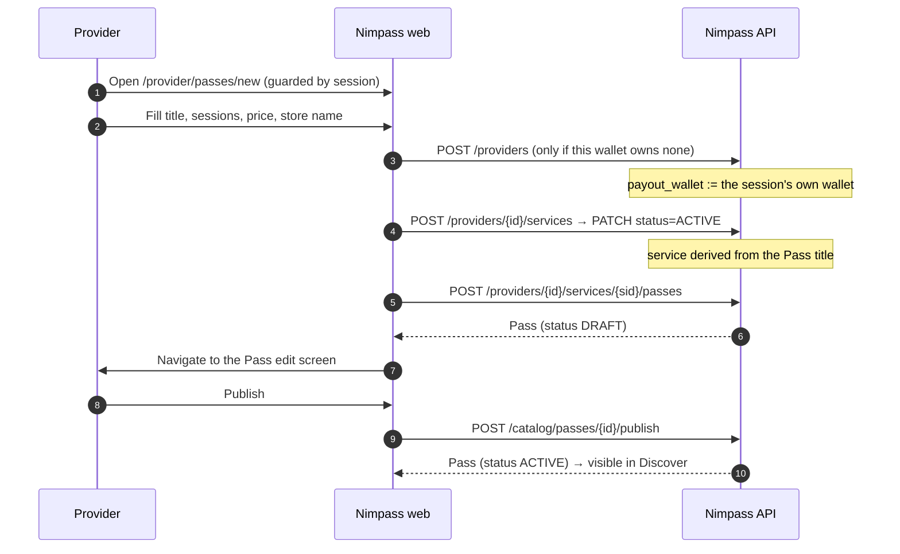

Three writes happen because the API models the real relation (a Pass belongs to a service, which belongs to a provider), but the *question* is never put to the provider. If a later write fails, the earlier records are invisible and are reused by the next attempt.

### Customer: discover → own

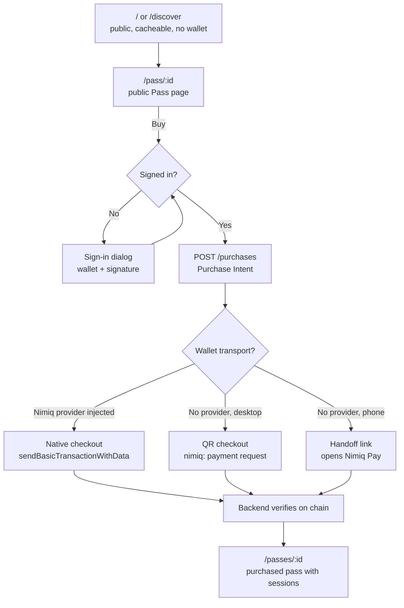

### Using a session

Two routes, one transactional write. The owner spends a session with a wallet signature; the provider records a session they delivered. Both end in `completeSessionTx` (`backend/internal/database/pass_session.go`), so the counter on `purchased_passes` and the `pass_sessions` rows can never disagree.

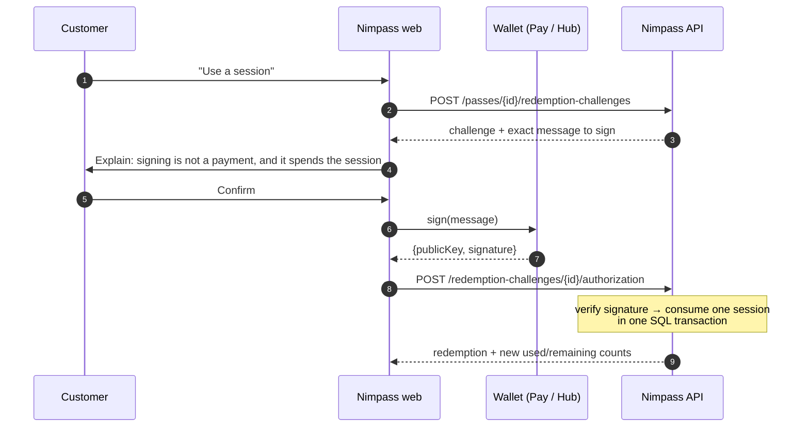

There is no provider-side confirmation step and no redemption QR. The signature by the pass owner *is* the authorisation, and it consumes the session in the same transaction (ADR-007).

---

## System architecture

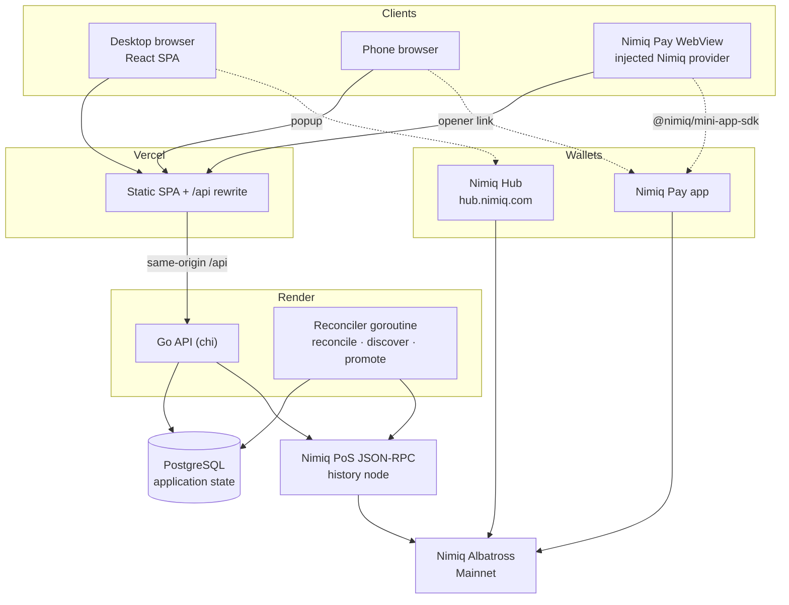

Two facts about this picture matter more than the boxes:

- **The frontend never talks to a Nimiq node.** It has no RPC URL. Everything the browser learns about the chain, it learns from the Nimpass API, which read it from a node itself.
- **The API and the reconciler share one RPC client object** inside the process (`NewRouterWithChain`). The public gateway's rate-limit budget is counted per IP, so two clients in one process would each believe they owned the whole window and together spend twice it (ADR-028).

---

## Wallet authentication

There are no passwords, no email addresses and no OAuth. An account is a Nimiq address that has demonstrated control of its private key.

### The two transports, one model

| Runtime | Wallet surface | SDK |
|---|---|---|
| Nimiq Pay WebView | injected Nimiq provider | `@nimiq/mini-app-sdk` |
| Ordinary browser | Nimiq Hub popup | `@nimiq/hub-api` |

Selection is capability detection, not user-agent sniffing: `window.nimiqPay` present → wait for the injected provider; absent → load the Hub (`src/lib/nimiq/wallet-runtime.ts`). The difference exists only below `WalletTransport` (`src/lib/nimiq/transport.ts`). Nothing in `src/app`, `src/pages`, `src/components` or `src/hooks` branches on which one answered.

### The challenge

`POST /api/v1/auth/challenges` mints a single-use challenge and, with it, the exact string to sign. The client never composes this text.

```
NIMPASS
Version: 1
Purpose: AUTH_LOGIN
Challenge: <challenge uuid>
Nonce: <32 random bytes, hex>
Wallet: <NQ… 36 chars>
Provider: <provider uuid, empty for login>
Network: MAINNET
Environment: production
Issued-At: <RFC3339Nano>
Expires-At: <RFC3339Nano>
```

| Control | Value | Enforced in |
|---|---|---|
| Nonce | 32 random bytes (`crypto/rand`), unique column in `auth_challenges` | `Auth.NewChallenge` |
| TTL | **5 minutes** (`ChallengeTTL`) | `validateProof` |
| Single use | `consumed_at` set atomically on success | `CompleteLogin` |
| Failed attempts | 5, then the challenge is dead | `failed_attempts` CHECK 0–5 |
| Purpose binding | `AUTH_LOGIN` or `VERIFY_PROVIDER_WALLET`, and the wrong one is `403` | `validateProof` |
| Network + environment binding | Challenge must match the deployment's `NIMIQ_NETWORK` and `APP_ENV` | `validateProof` |
| Wallet binding | Proof's wallet must equal the challenge's wallet | `validateProof` |
| Key binding | Address is **derived** from the submitted public key (Blake2b-256 → base32 → IBAN check) and must equal the challenge's wallet | `nimiq.Ed25519Verifier.Verify` |

### Signature verification

Ed25519 over one of exactly two preprocessors, never both, never a fallback loop (`backend/internal/nimiq/verify.go`):

- `raw` — the message bytes as handed to the wallet's `sign()`.
- `hub` — the documented Nimiq signed-message envelope: `sha256("\x16Nimiq Signed Message:\n" + len(message) + message)`.

A proof may *name* its scheme, and only the Hub transport does, because only the Hub documents its envelope. A proof that names nothing is verified under the deployment's `NIMIQ_SIGNING_SCHEME`. Naming a scheme cannot widen what a signature authorises: the message is always the server's own nonce-bearing challenge, and neither preimage is derivable from the other without the private key.

### Sessions

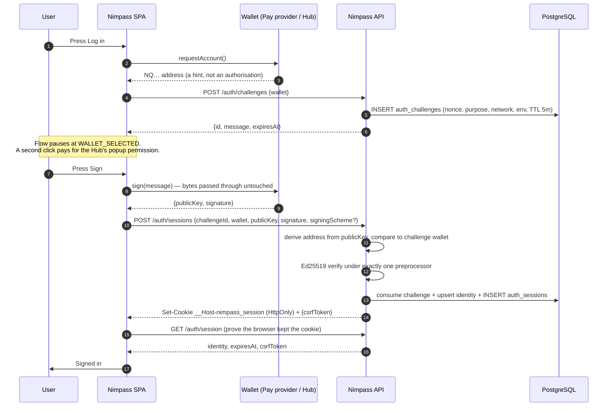

| Property | Value |
|---|---|
| Session token | 32 random bytes, hex; only its SHA-256 digest is stored |
| Cookie | `__Host-nimpass_session` (`nimpass_session` in local-insecure mode), `HttpOnly`, `Secure`, `SameSite=Lax`, `Path=/` |
| TTL | **24 hours** (`SessionTTL`) |
| CSRF | Double-submit. `csrfToken = SHA256("NIMPASS-CSRF-v1:" + sessionToken)`, required in `X-CSRF-Token` on every non-GET, compared constant-time against the stored digest *and* recomputed from the cookie |
| Logout | `DELETE /auth/session` revokes server-side and clears the cookie |
| Loss of session | Any `401` from a non-auth query clears the local session and authorisation-sensitive caches (`session-provider.tsx`) |

The frontend deliberately re-reads `GET /auth/session` after a successful proof. A `201` from the verify call does not establish that the browser actually kept the cookie — a distinction that matters inside the Nimiq Pay WebView, and the reason the production build calls a **same-origin** `/api` rather than an absolute API host.

---

## Payment architecture

This is the centre of the system, so it gets the most detail.

### The trust boundary

The single most important sentence in this README:

> **A client saying "I paid" does not create anything. A purchased pass exists only because the Nimpass backend asked a Nimiq node about a transaction and every check passed.**

| The frontend may tell the backend | The backend decides for itself |
|---|---|
| *which Pass* the customer wants to buy (`passId`) | the **price** — read from the `passes` row under a `FOR SHARE` lock, never from the request |
| *a candidate transaction hash* (`txHash`) — a nomination to go and look at | the **recipient** — the provider's `payout_wallet`, snapshotted into the intent |
| *that it would like the chain re-checked* (`reconcile`) | the **payment reference** — 16 random server-generated bytes |
| *that it is starting a wallet dialog* (`wallet-attempts`) | whether the transaction **exists, is canonical, and matches** |
| | whether a **purchased pass** may be created, and for whom |

A hash is never evidence. It is a pointer the backend follows to evidence it reads itself. A hash belonging to somebody else's transaction settles nothing; a hash that already settled anything is refused by a primary key.

### Before the payment: the Purchase Intent

`POST /api/v1/purchases {passId}` with an optional `Idempotency-Key` header. Inside one PostgreSQL transaction (`backend/internal/database/payment.go`, `Create`):

1. `pg_advisory_xact_lock` on `customer + pass`, so two taps cannot both proceed.
2. If the idempotency key was seen before → return that intent (`200` instead of `201`).
3. If a payable intent already exists for this customer and Pass → return it.
4. If an intent expired but is still inside its 5-minute settlement grace → `409 PURCHASE_IN_SETTLEMENT`. (Issuing a second intent there is how one customer pays twice for one thing.)
5. Read the Pass, its service and its provider `FOR SHARE`. This yields the price, the payout wallet and the owning account **from the database**, never the request.
6. Refuse: provider buying their own Pass (`403`), payout wallet equal to the buying wallet (`403`), Pass or service not `ACTIVE` (`409 PASS_UNAVAILABLE`), within 35 minutes of a fixed expiry (`409 PASS_PURCHASE_CUTOFF`), customer already holds a live pass for this Pass (`409 PASS_ALREADY_OWNED`).
7. Generate the payment reference: `NP1:` + 16 random bytes as hex (36 ASCII bytes total).
8. Construct `domain.NewPurchase`, which independently re-checks every invariant, and insert the row plus an `INTENT_CREATED` event.

The intent's immutable snapshot is what every later comparison is made against:

| Field | Source |
|---|---|
| `expected_price_luna` | `passes.price_luna` — integer Luna, 1 NIM = 100 000 Luna |
| `recipient_wallet` | `providers.payout_wallet` |
| `payment_reference` | fresh `NP1:` random |
| `network` | deployment's `NIMIQ_NETWORK` |
| `expected_wallet` | the address the session proved |
| `expires_at` | `created_at + 30 minutes` (`PurchaseIntentTTL`) |

The response carries a `paymentRequest` — `{recipient, valueLuna, valueNim, data, network, expiresAt, uri}` — and the `uri` is built server-side by `backend/internal/nimiq/request_link.go`:

```
nimiq:<NQ address>?amount=<decimal NIM>&message=NP1:<32 hex>
```

`amount` is decimal NIM, not Luna, because that is what the official request-link encoding specifies. `message` is capped at 64 UTF-8 bytes by the same encoder; an `NP1:` reference is 36. Nothing in the browser computes an address, a price or a reference.

### Desktop vs mobile checkout

Two transports, one lifecycle. The branch is chosen by capability first and device class second (`src/lib/checkout-route.ts`):

```
a Nimiq provider is injected here  → 'native'   pay here
no provider, desktop               → 'qr'       the phone that pays is another object in the room
no provider, phone                 → 'handoff'  tap through to Nimiq Pay
```

**Native (inside Nimiq Pay).** The mini app calls the official provider method with the backend's own values, untouched:

```ts
provider.sendBasicTransactionWithData({
  recipient: instruction.recipient,   // from the intent snapshot
  value:     instruction.valueLuna,   // integer Luna
  data:      instruction.data,        // the NP1: reference
})
```

Before that, `POST /purchases/{id}/wallet-attempts` takes a server-side dispatch lock under the purchase's row lock — so a second phone, a second tab or a reload cannot open a second approval sheet for the same intent. After approval, the wallet returns a hash, which is reported with `POST /purchases/{id}/transactions`.

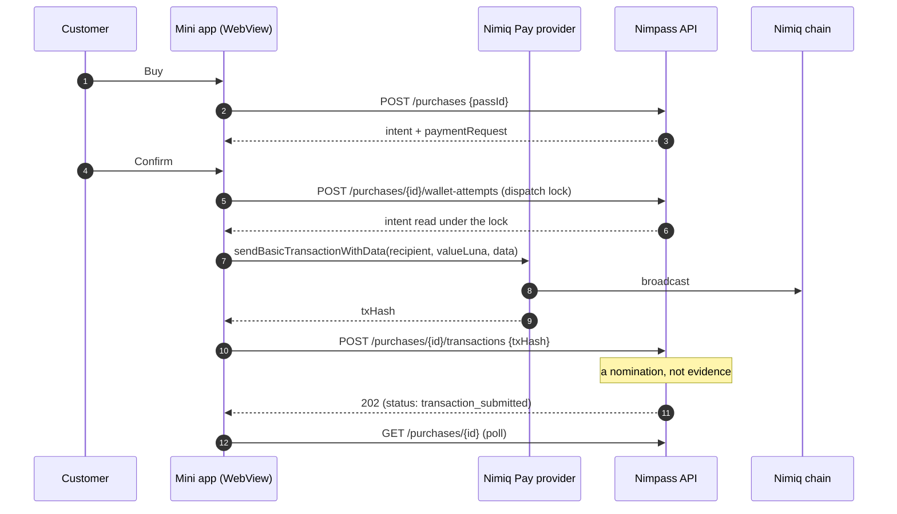

**QR (desktop).** The browser renders the server's `nimiq:` request link as a QR. The customer scans it in Nimiq Pay, on a phone, and approves there. **No client on that path is in a position to report the hash** — the paying device is not the device holding the intent. So the backend goes and finds it.

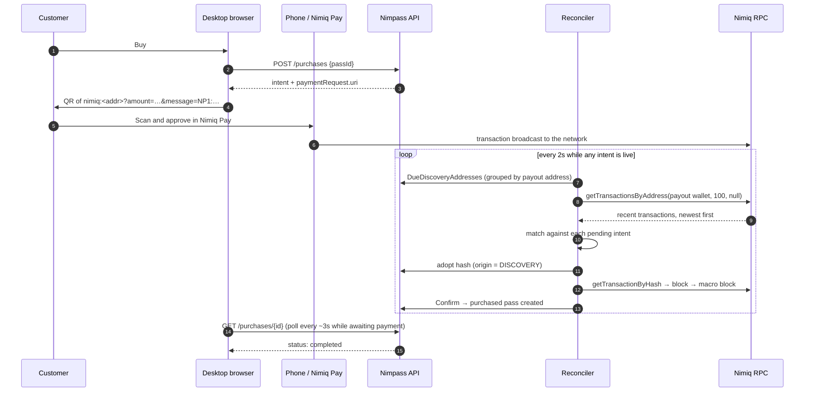

The desktop learns it was paid without the customer coming back to tell it anything. Closing the tab does not stop this: the backend's sweep is the authority, and the purchase is waiting when the customer returns.

**Handoff (phone browser, no provider).** A tap-through opener link (`nimiqpay://miniapp?url=…`, or the HTTPS Mini App opener) carries the purchase locator — never money — into Nimiq Pay, where the flow becomes the native one.

### Payment verification model

Every check below exists in code and must pass. `application.validateEvidence` reads the chain's answer, and `domain.Purchase.validateVerifiedPayment` independently re-derives the same conclusions from the resulting receipt — two checks, not one check in two places.

| # | Check | Rule | Implemented in |
|---|---|---|---|
| 1 | Hash identity | Node's `tx.hash` equals the candidate hash asked about | `validateEvidence` |
| 2 | Network | `tx.networkId` equals `24` for MAINNET / `5` for TESTNET, **and** the endpoint itself is proven to serve `MainAlbatross` / `TestAlbatross` | `validateEvidence`, `RPCClient.CheckNetwork` |
| 3 | Execution | `executionResult == true` once included; `flags == 0`; `toType == 0`; non-empty `proof`; `fromType` present | `validateEvidence` |
| 4 | Recipient | equals the intent's snapshotted `recipient_wallet` | `validateEvidence` |
| 5 | Self-transfer | sender ≠ recipient (a transfer to itself pays nobody) | `validateEvidence` |
| 6 | Amount | `tx.value` equals `expected_price_luna` **exactly**, to the Luna | `validateEvidence` |
| 7 | Reference | `recipientData` is either this intent's exact `NP1:` bytes, or empty. Another purchase's reference is refused outright | `referenceState` |
| 8 | Sender | must equal `expected_wallet` — **unless** the transaction carries this intent's own reference, in which case the reference is the stronger binding and the sender is recorded as an audit fact | `validateEvidence`, `validateVerifiedPayment` |
| 9 | Inclusion | `blockNumber` present, the block is a canonical `micro` block on the expected network, and it actually contains this transaction with the same execution result | `RPCClient.Inspect` |
| 10 | Timing — inclusion | block timestamp within `[intent.created_at, intent.expires_at + 5m]` and not in the future; inclusion after `expires_at` additionally requires that the backend saw the transaction in the mempool before expiry | `validateEvidence`, `Confirm` |
| 11 | Timing — report | the hash was reported or discovered before `expires_at + 5m` | `validateEvidence` |
| 12 | Finality | under `finality`: the macro block above the inclusion height exists, **and** the inclusion block is re-read afterwards and still has the same hash. Under `inclusion`: tracked in the background instead | `RPCClient.Inspect`, `Satisfies` |
| 13 | Global uniqueness | `verified_payments.transaction_hash` is the **primary key** — one transaction funds at most one purchase, ever | migration `000003` |
| 14 | One receipt per purchase | `verified_payments.purchase_id` is `UNIQUE` | migration `000003` |

The sender's **account type** is deliberately *not* constrained. Measured on a real device (2026-09-17), a Nimiq Pay payment arrived with `fromType: 2` — the app pays by early-resolving an HTLC, so `from` is the contract rather than a basic address. Requiring `fromType == 0` refused two real payments that were correct in every economic respect. What settles a payment is that value arrived at the recipient and cannot be taken back, which clauses 3–12 assert.

### Payment state machine

These are the real `purchases.status` values and the real transitions (`backend/internal/domain/purchase.go`).

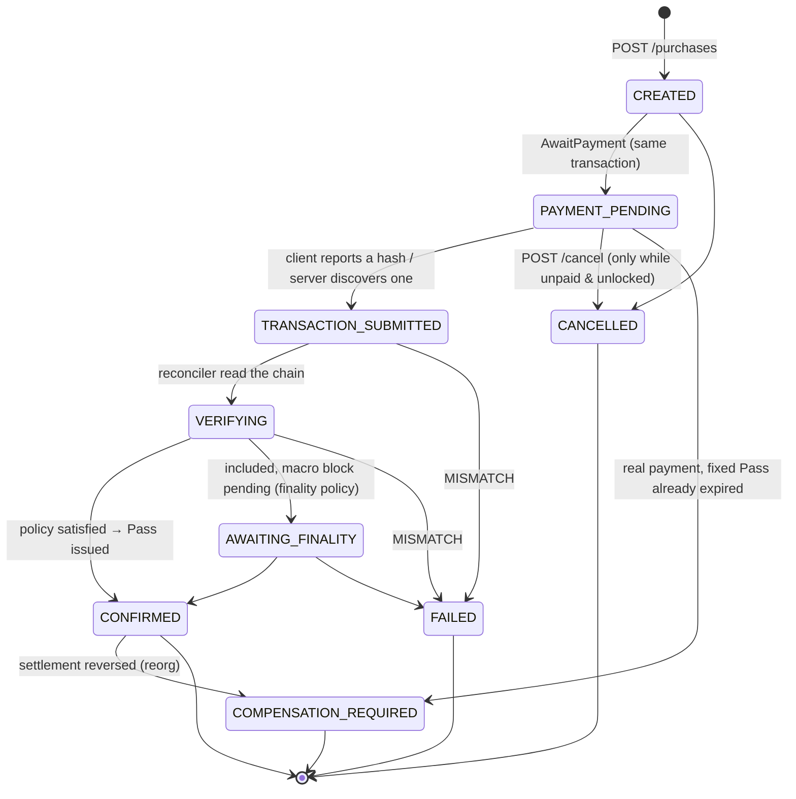

Notes a reviewer will want:

- **`EXPIRED` is a domain value that no live code path writes.** An unpaid intent simply stops being payable at `expires_at`; the API computes `status: "expired"` at read time. Keeping the row in `PAYMENT_PENDING` is what lets a late-discovered payment inside the grace window still settle. `ReconcileVerified` accepts `EXPIRED` for exactly that reason.
- **`CONFIRMED` is normally terminal.** The only thing that can move it is `ReverseSettlement`, which is deliberately unreachable through the ordinary `transition` map so no other caller is one typo away from withdrawing a paid Pass.
- The API projects these onto a customer-facing vocabulary (`purchaseDTO`): `awaiting_payment`, `transaction_submitted`, `verifying`, `awaiting_finality`, `uncertain_retryable`, `pass_provisioning`, `completed`, `compensation_required`, `cancelled`, `expired`, `permanently_failed` — plus a separate `settlement` object (`INCLUDED` / `FINALIZED` / `CONTESTED`) so "did I buy it?" and "is the payment permanent?" are never conflated into one field.

### Payment sequence

The full picture, from Buy to owned pass, with every real actor.

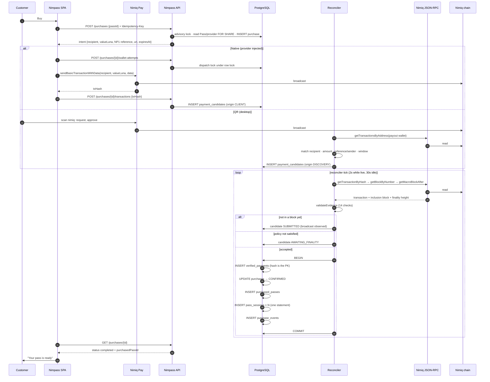

### Purchase fulfilment

The one place a purchased pass comes into existence is `PaymentRepository.Confirm`. It is a single PostgreSQL transaction:

```
BEGIN
  SELECT purchase … FOR UPDATE OF p
  ── already CONFIRMED/COMPENSATION_REQUIRED with this hash? → return existing pass (idempotent)
  ── candidate hash, submission window re-checked
  Purchase.ReconcileVerified(payment, policy, now)     ← domain re-validates everything
  INSERT verified_payments (transaction_hash PRIMARY KEY)   ← the global claim
  UPDATE purchases SET status='CONFIRMED', transaction_hash, verified_sender_wallet, confirmed_at
  INSERT purchased_passes (owner_identity_id, provider_identity_id, snapshot…)
  INSERT pass_sessions × original_sessions          ← one statement via unnest()
  UPDATE payment_candidates SET status='CONFIRMED'
  INSERT purchase_events (TRANSACTION_INCLUDED, PAYMENT_*, PURCHASE_CONFIRMED, PASS_PROVISIONED)
COMMIT
```

What makes duplicate fulfilment impossible:

| Mechanism | Prevents |
|---|---|
| `verified_payments.transaction_hash` PRIMARY KEY | one transaction paying for two passes, whichever path arrives first |
| `verified_payments.purchase_id` UNIQUE | one purchase acquiring two receipts |
| `purchases.transaction_hash` UNIQUE | the same hash on two purchase rows |
| `FOR UPDATE OF p` on every write path | two concurrent reconcilers acting on one purchase |
| `pg_advisory_xact_lock(customer+pass)` in `Create` | two taps creating two intents |
| Partial unique index on candidate hashes | two discovery sweeps adopting one transaction for two purchases |
| Idempotency key on `POST /purchases` | a retried create producing a second intent |
| Repeating a known hash on `Submit`/`Discover` is a no-op | a resubmitted hash conflicting with itself |
| `pass_sessions(purchased_pass_id, sequence_number)` unique | a second writer inventing an extra session |

If the process dies mid-reconcile, nothing partial is left: the transaction either committed or it did not, and the next sweep re-reads the same chain evidence and reaches the same conclusion.

Ownership is attached to the **authenticated buyer**, not the paying address. `purchased_passes.owner_identity_id` is `purchases.customer_context_id`, and `owner_wallet` is the wallet the session proved. The address that actually paid is kept separately as `verified_sender_wallet` — an audit fact, not an ownership claim. This matters because Nimiq Pay pays from whichever account the user approves, and its provider API offers no way to pin one.

### Settlement, finality and reorgs

`NIMIQ_CONFIRMATION_POLICY` decides how much chain certainty a payment needs **before** the Pass is issued. It governs the wait, never the validation.

| Policy | Pass issued when | Finality |
|---|---|---|
| `inclusion` *(production default)* | the transaction is canonically included in a micro block and all 14 checks pass — roughly a second of chain time | tracked afterwards; the receipt is stored `INCLUDED` and promoted to `FINALIZED` |
| `finality` | additionally, the macro block above the inclusion height exists and the inclusion block still matches | reached before the Pass exists |

An unrecognised value fails startup. A `Payments` struct assembled without one falls back to `finality` — the failure mode of forgetting a risk policy must be the slow, strict behaviour.

`PromoteDue` carries provisional receipts the rest of the way, and gives each one of four answers:

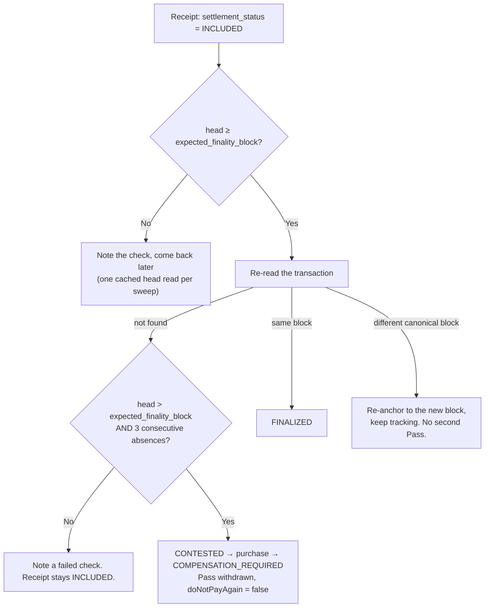

Contesting is the only path in the system that can take a Pass away, so it refuses until it is sure: the chain must be demonstrably past the height by which the transaction had to reappear, **and** the node must have said so three times, spaced by the settlement backoff. A throttled RPC (`429`) is never counted toward that threshold — inflating it with our own rate limiting could withdraw a Pass after fewer real absences than the rule names.

Compensation cases carry the right message for each cause:

| Reason | What the customer is told | `doNotPayAgain` |
|---|---|---|
| `PASS_EXPIRED_BEFORE_ACTIVATION` | payment received, but the Pass expired before it could be activated | `true` |
| `PAYMENT_SETTLEMENT_REVERSED` | the payment did not stay on the chain, so the Pass was withdrawn; no NIM left your wallet | `false` |

Resolution is recorded (`MANUAL_REFUND`, `REISSUE`, `PASS_WITHDRAWN`) but the remediation workflow itself is operator-side, not an in-app feature.

### Reconciliation and discovery

One background goroutine in the API process (`cmd/server/main.go`) runs three sweeps per tick plus rate-limit-bucket cleanup:

| Sweep | What it does | Batch |
|---|---|---|
| `ReconcileDue` | re-checks purchases that already have a candidate hash | 20 per tick, 4 concurrent, 8 s per purchase |
| `DiscoverDue` | finds payments nobody reported, by sweeping provider payout addresses | 10 addresses per tick, 100 transactions per address |
| `PromoteDue` | promotes / re-anchors / contests provisional receipts | 20 per tick, one cached head read for the whole sweep |

**Tempo is chosen after each pass, not fixed:** 2 seconds while any intent is live or any receipt is provisional, 30 seconds otherwise. Albatross produces a block roughly every second, so 2 s is close to as fast as the chain can tell anything, and it is only paid while somebody may be watching a screen.

**Backoff counts failures, not quiet.** A candidate in a healthy state (`retry_count = 0`) is re-read at the worker's own tempo; only consecutive `UNCERTAIN`/`NOT_FOUND` answers back off (30 s → 60 s → … → 8 min). A discovery scan that finds nothing is the *normal* state of a customer who has not paid yet and must never slow the next look down; only an unreachable or throttled endpoint backs an address off (10 s × 2^failures, capped).

**Discovery is grouped by address, not by purchase,** and is incremental. One provider with fifty pending intents costs one RPC call, and each address carries a cursor (the newest hash seen last time) so a sweep walks only what is new.

**Discovery decides nothing.** It nominates a hash, which then re-enters the unchanged `Inspect → validateEvidence → policy → Confirm` path. If two transactions match one intent indistinguishably, *neither* is adopted — two identical payments are a question for a human, not a coin flip.

**The RPC budget is read, not discovered by being refused.** `rpc.nimiqwatch.com` publishes `X-RateLimit-Remaining` and `X-RateLimit-Reset` (20 requests per fixed 10-second window per IP). The client tracks that window and refuses to send a request it knows cannot be served, returning `ErrRPCRateLimited` without a round trip. A throttle records *nothing* — not even the check time — because every field it would touch is an assertion about the payment, and nothing was learned about the payment. The client also caches the proven network (5 min), the chain head (1 s), consensus (2 s) and macro-block heights (pure policy, memoised).

---

## Blockchain state vs application state

The boundary is sharp and worth stating plainly.

```mermaid
flowchart LR
    subgraph CHAIN["Nimiq Albatross — what the chain proves"]
        C1["value transferred"]
        C2["sender address"]
        C3["recipient address"]
        C4["amount in Luna"]
        C5["transaction data (NP1 reference)"]
        C6["execution result"]
        C7["inclusion block + macro finality"]
        C8["network identity"]
    end

    subgraph BRIDGE["The bridge — backend/internal/nimiq + application/payment.go"]
        B1["Inspect(hash) → ChainEvidence"]
        B2["TransactionsByAddress → candidates"]
        B3["validateEvidence → VerifiedPayment"]
        B4["Confirm() — one SQL transaction"]
    end

    subgraph PG["PostgreSQL — what the application owns"]
        P1["identities, providers, services"]
        P2["passes (the catalogue)"]
        P3["purchases (intents + lifecycle)"]
        P4["verified_payments (receipts)"]
        P5["purchased_passes + pass_sessions"]
        P6["redemptions, compensation_cases"]
        P7["purchase_events (audit trail)"]
    end

    CHAIN --> BRIDGE --> PG
```

- The chain knows nothing about Passes, providers, sessions or customers. It knows that an address sent an exact number of Luna to another address, carrying 36 bytes of data, in a block.
- The database knows nothing about whether money moved. It knows what was offered, what was intended, and what a verifier concluded.
- **The `NP1:` reference is the bridge.** Sixteen random bytes the server generated for one intent and told nobody else. A transaction carrying them was made by somebody holding that intent's payment instruction — a stronger binding than the sender address, which Nimiq Pay chooses at approval time.
- **`verified_payments` is the join.** Its primary key is the transaction hash, which is exactly the statement "this on-chain fact has been spent, once, on this purchase."

---

## Reliability and failure recovery

Each row is implemented behaviour, not aspiration.

| Scenario | What happens |
|---|---|
| User dismisses the wallet dialog | `USER_REJECTED` → `CANCELLED`, not an error. The dispatch lock is released and the intent is still payable. |
| Wallet reports insufficient funds / invalid transaction | Definite refusals release the lock and report a specific reason. Nothing is marked paid. |
| Wallet call times out, or its response is lost | **Never** reported as failure. The state becomes `UNCERTAIN` and the dispatch lock stays held — a request that was sent and unanswered may have been committed. A false "it failed" is what makes people pay twice. |
| Transaction succeeded but the frontend lost the response | The hash is written to `localStorage` before the report and replayed on resume; and independently, server-side discovery finds the payment with no client involved. |
| Browser closed after payment | Nothing is lost. The reconciler settles the purchase, and the pass is in My Passes when the customer returns. |
| Desktop QR paid from a phone, desktop has no hash | The designed case. `DiscoverDue` sweeps the provider's payout address and correlates by reference (or by the sender/amount/window tuple when the scanner dropped the message). |
| Page refreshed mid-checkout | The purchase id is in the URL (`/purchases/:id`); `resume()` re-reads the record and continues polling. |
| RPC unavailable / node resyncing | Recorded as `UNCERTAIN`, never as "no payment". Public browsing keeps working; readiness reports `nimiq.status: "unverified"` and stays `200`. |
| RPC rate limited (`429`) | Treated as "we did not look". Nothing is recorded — not the check time, not a retry count — so throttling cannot push the next look out or count toward contesting a settlement. |
| Transaction not found yet (mempool) | `getTransactionFromMempool` is consulted; a mempool transaction is recorded as observed-broadcast but settles nothing under either policy. |
| Awaiting macro finality | Under `inclusion`, the Pass already exists and `PromoteDue` finishes the job. Under `finality`, the purchase sits in `AWAITING_FINALITY` and is re-read at the worker's tempo. |
| Duplicate HTTP requests | `Idempotency-Key` on create; repeated `Submit`/`Discover` of the same hash is a no-op; `Cancel` on a non-pending purchase is `409`. |
| Duplicate on-chain payment | The second transaction cannot settle anything: `verified_payments.transaction_hash` is a primary key and the intent already has its receipt. |
| Two reconciler replicas | Safe. Work lists are queries, every write takes the purchase's row lock and re-reads inside the transaction, and unique constraints are the final authority. |
| Server restarted mid-settlement | The first sweep runs immediately on boot (`time.NewTimer(0)`) and picks up everything that happened while the process was down. |
| Purchase intent expires | Nothing is swept. It stops being payable at `expires_at`; a payment already made can still settle for 5 more minutes; a new intent is refused during that grace with `PURCHASE_IN_SETTLEMENT`. |
| A Pass is withdrawn between page load and Buy | `409 PASS_UNAVAILABLE`, before any money can move. Passes already bought are untouched. |
| Session expires while a tab is open | Any `401` from a protected query clears the local session and authorisation-sensitive caches, and says so. |
| Provisional settlement reversed by a reorg | `ReverseSettlement` → `COMPENSATION_REQUIRED` with `doNotPayAgain: false`, and copy that says no NIM left the wallet. |

---

## Data model

Simplified to the relations that carry the product. Full definitions are in `backend/migrations/`.

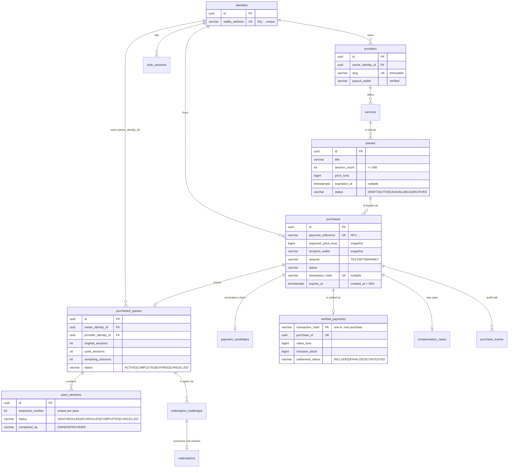

Two modelling choices worth calling out:

- **The counters on `purchased_passes` were not replaced by a view over `pass_sessions`.** They stay, with their CHECK constraints (`used + remaining = original`, `remaining >= 0`), because those constraints are the database-level guarantee that a session cannot be spent twice. What migration `000015` added is the requirement that the two agree — every `COMPLETED` row corresponds to one increment, written in the same transaction.
- **`provider_identity_id` is denormalised onto `purchased_passes` on purpose.** It is read on every session write, and resolving it through `providers.owner_identity_id` at write time would make an authorisation check depend on a row the provider can edit.

---

## API architecture

REST over JSON, versioned at `/api/v1`, with [`backend/openapi.yaml`](backend/openapi.yaml) as the canonical contract. The frontend has a drift test (`src/api/openapi-drift.test.ts`) that compares the literal paths the client uses against the spec.

Success bodies are the resource itself, unwrapped. Errors are uniform:

```json
{ "error": { "code": "PASS_ALREADY_OWNED", "message": "You already own this pass", "requestId": "…" } }
```

The UI branches on `code`, never on message text. Representative codes: `VALIDATION_ERROR`, `AUTH_REQUIRED`, `CSRF_INVALID`, `ORIGIN_FORBIDDEN`, `NOT_FOUND`, `CHALLENGE_EXPIRED`, `CHALLENGE_CONSUMED`, `PAYMENT_CONFLICT`, `INTENT_EXPIRED`, `PASS_UNAVAILABLE`, `PASS_ALREADY_OWNED`, `PURCHASE_IN_SETTLEMENT`, `SELF_PURCHASE_NOT_ALLOWED`, `PASS_PURCHASE_CUTOFF`, `RATE_LIMITED`, `NIMIQ_NETWORK_MISMATCH`.

### Route groups

| Group | Auth | Endpoints |
|---|---|---|
| Health | none | `GET /health/live`, `GET /health/ready` |
| Auth | none / session | `POST /auth/challenges`, `POST /auth/sessions`, `GET /auth/session`, `DELETE /auth/session` |
| Public catalogue | none | `GET /public/config`, `/public/categories`, `/public/passes`, `/public/passes/{id}`, `/public/providers`, `/public/providers/{id}`, `/public/providers/by-slug/{slug}`, `GET /media/{id}` |
| Provider & catalogue | session + ownership | `POST /providers`, `PATCH /providers/{id}`, `POST /providers/{id}/services`, `POST /providers/{id}/services/{sid}/passes`, `PATCH /catalog/passes/{id}`, `POST /catalog/passes/{id}/publish`·`/unpublish`, `DELETE /catalog/passes/{id}`, `POST /media` |
| Payout wallet | session + provider ownership + two signatures | `POST /providers/{id}/payout-challenges`, `POST /providers/{id}/payout-verifications` |
| Purchases | session + record ownership | `POST /purchases`, `GET /purchases`, `GET /purchases/{id}`, `POST /purchases/{id}/wallet-attempts`, `…/{attemptID}/release`, `POST /purchases/{id}/transactions`, `POST /purchases/{id}/reconcile`, `POST /purchases/{id}/cancel` |
| Owned passes & sessions | session + owner-or-provider | `GET /passes`, `GET /passes/{id}`, `GET /passes/{id}/sessions`, `PATCH /pass-sessions/{id}/schedule`, `POST /pass-sessions/{id}/complete`, `GET /providers/{id}/purchased-passes` |
| Redemption | session + pass ownership | `POST /passes/{id}/redemption-challenges`, `GET …/current`, `POST /redemption-challenges/{id}/authorization`, `GET /passes/{id}/redemptions`, `GET /providers/{id}/redemptions` |

**Authorisation is resolved inside the query, not beside it.** Every private handler passes the session identity down to the repository, which scopes the SQL by `customer_context_id`, `owner_identity_id` or `owner_identity_id = providers.owner_identity_id`. A record belonging to somebody else is `404`, not `403` — knowing a URL grants nothing.

**Rate limits** are atomic PostgreSQL buckets shared across replicas (keys hashed, rows expired by the worker), applied per identity or per client IP:

| Operation | Limit |
|---|---|
| Login challenge | 20 / 5 min per IP, 10 / 5 min per wallet |
| Login verify | 40 / 5 min per IP |
| Create purchase | 20 / min per identity |
| Submit transaction / reconcile | 30 / min per identity |
| Wallet attempt | 20 / min per identity |
| Redemption challenge / authorization | 10 and 20 / 5 min per identity |
| Catalogue writes | 60 / min per identity, 120 / min per IP |
| Media upload | 20 / 10 min per identity |

---

## Security architecture

Only mechanisms that exist in the repository.

**Wallet identity.** Ed25519 signature over a server-authored, nonce-bearing, purpose-bound, network-bound, environment-bound, single-use, 5-minute challenge. The address is derived from the submitted public key and compared to the challenge's wallet — a claimed address without key binding proves nothing. Exactly one preprocessor per proof; the server never retries under a second scheme.

**No key material anywhere.** Nimpass handles no private keys, seed phrases or wallet secrets. Both wallet transports are security boundaries that own approval and signing. Nothing prefixed `VITE_` contains a secret, by rule.

**Server-side chain verification.** See [Payment verification model](#payment-verification-model). Client-reported hashes are nominations; server-discovered hashes go through the identical path.

**Network fail-closed.** `config.Parse` binds `APP_ENV` to `NIMIQ_NETWORK` one-to-one (`production ⇔ MAINNET`). `BindDeployment` pins a database to one network/environment on first boot and refuses to start against rows from another. Startup probes the RPC endpoint's actual chain — a mismatch is fatal, a malformed reply is fatal, and everything else (unreachable, throttled, syncing) is uncertainty that leaves the service serving. `/health/ready` applies the same split, answering `503 NIMIQ_NETWORK_MISMATCH` on a wrong chain.

**Sessions and CSRF.** HttpOnly `__Host-` cookie, `SameSite=Lax`, `Secure` outside local development; 24-hour TTL; only a SHA-256 digest is stored. Double-submit CSRF token required on every non-GET, verified constant-time *and* re-derived from the cookie. Every unsafe method also requires the exact `PUBLIC_ORIGIN` as `Origin` (falling back to `Referer`). CORS is exact-origin credentialed only.

**HTTP hardening.** `X-Content-Type-Options: nosniff`, `Referrer-Policy: no-referrer`, `X-Frame-Options: DENY`, a backend-only CSP (`default-src 'none'; frame-ancestors 'none'; base-uri 'none'`), a restrictive `Permissions-Policy`, HSTS in production, `Cache-Control: no-store`. Bounded header size (32 KiB), body size (32 KiB JSON), explicit read/write/idle timeouts, `DisallowUnknownFields` on every decode, and sanitised correlation IDs (CR/LF and oversized values discarded).

**Database integrity as the last authority.** Wallet-shape CHECKs, reference-shape CHECKs, hash-shape CHECKs, `used + remaining = original`, `remaining >= 0`, settlement-status field consistency, session count ≤ 500, immutable provider slug enforced by trigger, and the uniqueness constraints listed under [Purchase fulfilment](#purchase-fulfilment). Every economic write is a single SQL transaction with the relevant rows locked.

**Uploads.** Covers are decoded, dimension-bounded and re-encoded server-side to JPEG, capped at 2 MiB, stored on disk under a generated UUID — never the original filename — with only a reference in the database.

**Logging.** No wallet address, hash-derived secret or session value is logged. The readiness payload deliberately carries no endpoint URL, host or credential.

**Secrets.** `.env.example` and `.env.production.example` contain placeholders only; the application does not read `.env` files itself. Real values come from the hosting provider's secret store.

---

## Backend architecture

Go 1.26, `chi` router, `pgx/v5` pool, no ORM, no code generation. The layering is real dependency separation rather than a label:

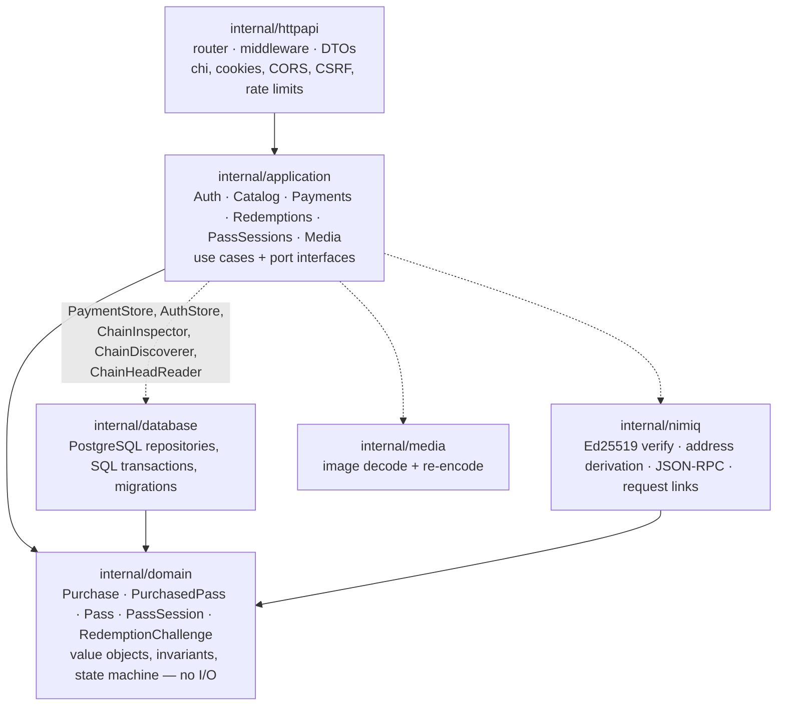

- **`internal/domain`** imports nothing but the standard library. It owns `Luna` (integer, no floating point anywhere), `WalletAddress`, `PaymentReference`, `SessionCount`, the purchase state machine, and `validateVerifiedPayment` — the domain's own restatement of every economic condition a settlement rests on.
- **`internal/application`** defines the ports it needs (`PaymentStore`, `ChainInspector`, `ChainDiscoverer`, `ChainHeadReader`) and depends on interfaces, not on `database` or `nimiq` concretes. This is what makes the payment tests able to drive the whole reconciler against fakes with no PostgreSQL and no node.
- **`internal/database`** owns SQL. Repositories return domain types; SQL never leaks upward. Migrations are forward-only, checksum-verified at startup and by `/health/ready` (`CheckMigrations`).
- **`internal/nimiq`** is the only place that speaks JSON-RPC or does cryptography. It never handles private keys.
- **`internal/httpapi`** owns transport concerns and DTO shapes and nothing else.

Commands: [`cmd/server`](backend/cmd/server) (API + reconciler), [`cmd/migrate`](backend/cmd/migrate), [`cmd/seed`](backend/cmd/seed) (local browsable account + session cookie), [`cmd/verify-sign-fixture`](backend/cmd/verify-sign-fixture) (names which signing scheme verifies a captured device fixture, offline), [`cmd/live-testnet-harness`](backend/cmd/live-testnet-harness) (developer tool against a live Testnet node).

The backend also carries an unusually high comment-to-code ratio, and that is deliberate: nearly every non-obvious clause names the failure it was written to prevent and, where applicable, the date it was measured on a real device.

---

## Frontend architecture

React 19 + TypeScript, built with Vite 8, styled with Tailwind CSS v4, server state in TanStack Query, routing by React Router 7.

```
src/
├── app/          router, providers, session + wallet context, root layout
├── pages/        one file per route; provider/ holds the Pass form
├── components/   layout · ui · catalog · payment · pass · provider · wallet · auth · home
├── hooks/        use-purchase-flow, use-session, use-redemption, use-catalog,
│                 use-provider-workspace, use-checkout-device, …
├── api/          the only place fetch() is called; one module per resource
├── lib/          nimiq/ (wallet transports), checkout-device, checkout-route, format
├── types/        domain, payment, auth, wallet, api, redemption
├── dev/          DEV-only catalogue fixtures, stripped from production builds
└── styles/       design tokens
```

Why it is shaped this way:

- **One wallet abstraction.** `lib/nimiq/transport.ts` defines `WalletTransport`; `mini-app-transport.ts` and `hub-transport.ts` implement it. Nothing above that boundary knows which runtime answered. `lib/nimiq/client.ts` is the single module that imports `@nimiq/mini-app-sdk` or touches `window.nimiq`.
- **Request arguments are promises, not awaited values.** The Hub must open its popup synchronously inside the user's click, but every wallet operation needs backend-authored input first. `@nimiq/hub-api` accepts `Promise<Request>` and opens the window *before* awaiting it — so callers write `signChallenge(fetchChallenge())`, never `signChallenge(await fetchChallenge())`. The wallet runtime also resolves eagerly on mount so the click-to-popup path contains no `await`.
- **One approval at a time.** A process-wide lock in `client.ts` refuses (rather than queues) a second native approval sheet while one is open. Queuing would pop a sheet the user has stopped expecting.
- **Server state lives only in TanStack Query.** Retries are narrow: a network blip is worth retrying, "this pass is completed" is not. Private query roots (`passes`, `provider`, `purchases`, `redemptions`) are cancelled and removed on sign-out and on any `401`.
- **The API client is the only `fetch` site.** It handles `credentials: 'include'`, the CSRF header, `Idempotency-Key`, query encoding and error normalisation into `ApiError` with a stable `code`.
- **Checkout branches on capability, then device.** `classifyCheckoutRoute` asks whether a provider is injected (can a transaction start here at all?), and only then does device class shape the handoff. A phone in Safari has a phone-shaped screen and no provider whatsoever, so "mobile ⇒ native checkout" would simply be false.
- **Routing is code-split except the landing page,** with pathless `RequireSession` guards so a deep link keeps its URL and renders as soon as the session exists. Old provider-workspace URLs redirect rather than 404.
- **Development fixtures are structurally isolated.** The fixture layer is behind `import.meta.env.DEV`, and `src/dev/production-isolation.test.ts` verifies it is eliminated from the built artefact. Purchases, passes and redemptions are never faked.

---

## UI and UX

The design system is specified in [`docs/03-DESIGN-SYSTEM.md`](docs/03-DESIGN-SYSTEM.md) and implemented as tokens in `src/styles/index.css` — never scattered through components.

**A warm, light, paper-like identity.** The ground is `#faf8f5` rather than white, with three tonal steps above it. Depth comes from those steps and from spacing, not from shadows or a border around everything. One restrained accent — a deep desaturated pine `#0e6a58` — is reserved for primary action, identity, status and focus. There is intentionally no dark theme.

**The pass is an object, so it gets its own material.** The single dark surface in the product is the pass itself (`--color-pass: #10312a`), with a ticket-edge treatment and a per-Pass accent the provider picks from six curated earth tones. No metallic gradient, no fake card numbers, no NFT sheen. That material is what separates "my pass" from "a card on a page".

**Type and spacing scale fluidly.** A `micro → display` scale built on `clamp()`, spacing on multiples of 4, radii from 8 to 32 and pill. Fonts are Inter and Instrument Sans.

**Responsive because it has to be.** The same build runs in a desktop browser, a phone browser and the Nimiq Pay WebView at phone width. The mobile checkout is an overlay sheet rather than a separate page (ADR-018); the desktop checkout is a modal with a QR. Buttons are 44 px tall below the `sm` breakpoint and only shrink to a compact size above it.

**Blockchain concepts are translated, not hidden.** The customer sees a price in NIM, a provider name and a session count. They are told plainly that signing a redemption is *not* a payment — and that confirming it spends the session — before any native dialog opens. Payment status is described in the customer's terms (`Waiting for payment`, `Checking your payment`, `Your pass is ready`) while the API keeps a separate, precise `settlement` object underneath.

**Honesty in every state.** Loading states are skeletons of the real layout. Empty states say what would be there and offer the action that fills it. Error states say what failed and what to do; the catalogue never falls back to sample content when the backend is unreachable. A dismissed wallet dialog is rendered as a cancellation, never a failure. Once a transaction may exist, the UI cannot walk back to "Ready to pay" — no screen is allowed to invite a second payment.

**Trust is shown, not asserted.** The checkout displays the recipient address, the exact amount, the payment reference and the expiry; the QR modal re-checks the server's `nimiq:` URI against the terms printed beside it and withholds the code if they disagree.

---

## Production infrastructure

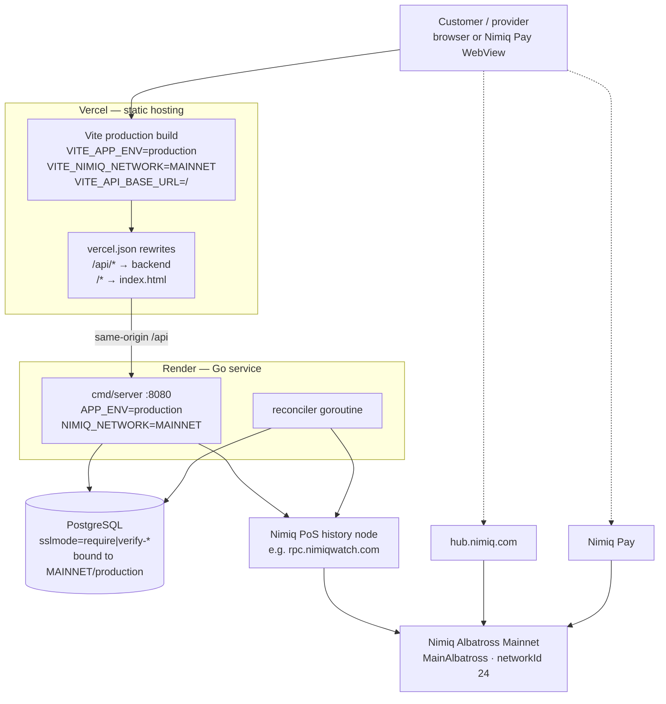

| Concern | Production setting |
|---|---|
| Network | **Nimiq Mainnet.** `config.Parse` refuses `production` with anything but `MAINNET`, and the frontend's `config/deployment.ts` refuses the same pair at build time. |
| Frontend | Vercel static build; `vercel.json` pins the build env and rewrites `/api/*` to the backend and everything else to `index.html` for client routing. |
| Backend | Render, `https://nimpass-backend.onrender.com`, single service running the API and the reconciler in one process. |
| Database | PostgreSQL with TLS required (`sslmode=require`/`verify-ca`/`verify-full`); production requires an **empty** database — `BindDeployment` will not run against Testnet rows, because a transaction hash belongs permanently to the chain it was made on. |
| RPC | A synced Nimiq PoS **history** node. The desktop QR flow needs `getTransactionsByAddress`, which only an address-indexing history node serves. `rpc.nimiqwatch.com` is verified to work unchanged (MainAlbatross, networkId 24, every method Nimpass calls) but is a free public gateway with no SLA and a 20-request/10-second budget. |
| Settlement policy | `NIMIQ_CONFIRMATION_POLICY=inclusion` — the Pass is issued in seconds and finality is promoted in the background. Mainnet batches are 60 blocks, so `finality` would mean a 0–60 s wait on a payment already on chain. |
| Cookies | Same-site `/api` keeps the session first-party, which is what makes login work inside the Nimiq Pay WebView. |
| Deployment trigger | Git push, via each provider's standard build pipeline. There is no bespoke CI configuration in the repository. |

**Why same-origin `/api` matters:** inside the Nimiq Pay WebView, a cross-origin API host makes the session cookie a cross-origin cookie the WebView is free to drop — and the login then fails with "the browser did not keep the session cookie."

---

## Repository structure

```
nimpass/
├── backend/                      Go API + reconciler
│   ├── cmd/
│   │   ├── server/               HTTP server and the settlement worker
│   │   ├── migrate/              forward-only migration runner
│   │   ├── seed/                 local browsable account + session cookie
│   │   ├── verify-sign-fixture/  names the signing scheme of a device capture
│   │   └── live-testnet-harness/ developer tool against a live Testnet node
│   ├── internal/
│   │   ├── domain/               invariants, value objects, state machine (no I/O)
│   │   ├── application/          use cases + the ports they depend on
│   │   ├── database/             PostgreSQL repositories and migration checks
│   │   ├── nimiq/                Ed25519 verify, address derivation, JSON-RPC, request links
│   │   ├── httpapi/              router, middleware, DTOs
│   │   ├── media/                cover image decode/re-encode
│   │   └── config/               environment parsing and fail-closed validation
│   ├── migrations/               19 forward-only SQL migrations
│   └── openapi.yaml              canonical API contract
├── frontend/web/                 React 19 + TypeScript SPA / Mini App
│   ├── src/                      see Frontend architecture
│   ├── config/deployment.ts      build-time network/environment pairing
│   └── vercel.json               static hosting + /api rewrite
├── docs/                         product, flows, design system, Nimiq integration,
│                                 architecture, security, competition, ADRs
├── scripts/testnet-node.sh       local Nimiq Albatross Testnet history node (Docker)
├── start.sh                      one-command local Testnet orchestrator
└── LICENSE                       MIT
```

---

## Tech stack

| Layer | Technology | Evidence |
|---|---|---|
| Frontend framework | React 19, TypeScript ~6.0 | `frontend/web/package.json` |
| Build | Vite 8, `@vitejs/plugin-react` | `vite.config.ts` |
| Styling | Tailwind CSS v4 via `@tailwindcss/vite`, CSS custom-property tokens | `src/styles/index.css` |
| Routing | React Router 7 (`createBrowserRouter`, lazy routes) | `src/app/router.tsx` |
| Server state | TanStack Query v5 | `src/app/query-client.ts` |
| UI primitives | Radix Dialog + Slot, `class-variance-authority`, `tailwind-merge`, `lucide-react` | `src/components/ui/` |
| Wallet (Mini App) | `@nimiq/mini-app-sdk` | `src/lib/nimiq/client.ts` |
| Wallet (browser) | `@nimiq/hub-api` | `src/lib/nimiq/hub-transport.ts` |
| Identicons / QR | `@nimiq/identicons`, `qrcode`, `qr-scanner` | `src/lib/nimiq/identicon.ts` |
| Backend language | Go 1.26 | `backend/go.mod` |
| HTTP | `go-chi/chi/v5` | `internal/httpapi/router.go` |
| Database driver | `jackc/pgx/v5` (pool, no ORM) | `internal/database/postgres.go` |
| Crypto | `crypto/ed25519`, `golang.org/x/crypto/blake2b` | `internal/nimiq/verify.go` |
| Database | PostgreSQL | `backend/migrations/` |
| Blockchain | Nimiq Albatross (PoS), JSON-RPC | `internal/nimiq/rpc.go` |
| Frontend tests | Vitest 5, Testing Library, jsdom | `vite.config.ts` |
| Lint | oxlint (frontend), `go vet` / golangci-lint (backend) | `package.json`, `backend/README.md` |
| Hosting | Vercel (frontend), Render (backend) | `vercel.json` |

---

## Local development

Local development runs on **Nimiq Testnet**. Configuration refuses any other pairing.

### Prerequisites

- Go and Node.js
- PostgreSQL reachable locally (the launcher will start an installed service, but will not install one)
- Docker, if you want a local Nimiq Testnet history node

### The supported path

```sh
git clone <this repository>
cd nimpass
./start.sh
```

With no `NIMPASS_ENV_FILE` set, `start.sh` bootstraps everything: it creates the git-ignored `backend/.env.testnet.local` and `frontend/web/.env.local`, starts a local PostgreSQL service if needed, creates the `nimpass_test` database, applies migrations, discovers the LAN IPv4 address, builds and serves the frontend, starts the backend, and prints the Custom URL to paste into Nimiq Pay for on-device testing.

```sh
./start.sh          # start (default)
./start.sh status   # recorded PIDs and whether the ports are listening
./start.sh restart
./start.sh stop     # stop the launcher, both services and leftover listeners
```

`NIMPASS_FRONTEND_MODE=dev` uses Vite's dev server instead of a production build served by `npm run preview`. Setting `NIMPASS_ENV_FILE` to an absolute path bypasses the bootstrap and uses your own environment untouched.

The frontend is configured with `VITE_API_BASE_URL=/` and a local-only same-origin proxy, deliberately — not an absolute LAN URL. Inside the Nimiq Pay WebView a cross-origin API host makes the session cookie cross-origin, and login then fails.

### A local Testnet node

Payment verification needs a synced node. Without one, a real phone payment is dispatched and never verified: the purchase stays pending and no Pass is issued.

```sh
./scripts/testnet-node.sh start    # official ghcr.io/nimiq/core-rs-albatross, history node
./scripts/testnet-node.sh status   # network, consensus, head block
./scripts/testnet-node.sh wait     # block until consensus is established
./scripts/testnet-node.sh logs
./scripts/testnet-node.sh stop
```

RPC is published on `127.0.0.1:8648` only; the node holds no wallet, no validator key and no funds. `https://rpc.testnet.nimiqwatch.com` works as a drop-in public alternative (rate limited).

### Running the pieces by hand

```sh
# backend/
go run ./cmd/migrate
go run ./cmd/server

# frontend/web/
npm install
npm run dev
```

### Browsing a seeded account on a desktop

Every customer-owned and provider screen sits behind a backend-issued session, and a session needs a real wallet signature — which a desktop browser without a wallet cannot produce. `cmd/seed` fills a local database with both sides of the product and mints a session cookie for it:

```sh
DATABASE_URL=postgres://…/nimpass_dev go run ./cmd/seed -display-name "Your Name"
```

Never point it at anything but a disposable local database.

---

## Environment variables

### Backend

| Variable | Required | Purpose |
|---|---|---|
| `APP_ENV` | yes | `development` \| `test` \| `production`. Bound one-to-one with `NIMIQ_NETWORK`. |
| `NIMIQ_NETWORK` | yes | `TESTNET` \| `MAINNET`. `production ⇔ MAINNET`. |
| `DATABASE_URL` | yes | PostgreSQL URL with a database name. Production requires `sslmode=require`/`verify-ca`/`verify-full`. |
| `NIMIQ_RPC_URL` | yes (except `test`) | Fixed http(s) endpoint of a synced PoS **history** node. HTTPS required outside local development. |
| `PUBLIC_ORIGIN` | yes | Exact frontend origin allowed to make credentialed requests. HTTPS in production. |
| `HTTP_ADDR` | no | Listen address, default `:8080`. |
| `NIMIQ_SIGNING_SCHEME` | no | `raw` (code default) \| `hub`. Applies to proofs that do not name their own scheme. |
| `NIMIQ_CONFIRMATION_POLICY` | no | `inclusion` (default) \| `finality`. Governs the wait, never the validation. An unrecognised value fails startup. |
| `SESSION_COOKIE_MODE` | no | `secure` (default) \| `local-insecure` (non-production HTTP origins only). |
| `TRUSTED_PROXY_CIDRS` | no | Comma-separated CIDRs allowed to supply forwarded client IPs. Empty means forwarded headers are ignored. |
| `MIGRATIONS_DIR` | no | Default `migrations`. Ship it with the binary. |
| `MEDIA_DIR` | no | Default `var/media`. Re-encoded cover images. |
| `TEST_DATABASE_URL` | tests only | Disposable database whose name ends in `_test`. Never set in production. |

### Frontend

Everything prefixed `VITE_` is inlined into the public bundle. No secret belongs in any of them.

| Variable | Required | Purpose |
|---|---|---|
| `VITE_APP_ENV` | yes | `production` \| `development` \| `test`. Validated against the network at build time. |
| `VITE_NIMIQ_NETWORK` | yes | `MAINNET` \| `TESTNET`. Declares which network the *backend* is configured for. |
| `VITE_API_BASE_URL` | yes | `/` in production (same-origin). An absolute origin works if CORS and cookies are same-site. |
| `VITE_DEV_FIXTURES` | no | `1` serves the public catalogue from DEV-only fixtures. Ignored in production builds. Tests require `0`. |
| `VITE_NIMIQ_INIT_TIMEOUT_MS` | no | How long to wait for the injected provider before falling through to the Hub. Default 3000. |
| `VITE_NIMIQ_HUB_URL` | no | Local Hub for development. **Ignored on Mainnet**, so a misconfigured build cannot route real payments through an arbitrary origin. |
| `VITE_NIMIQ_PAY_OPENER_BASE` | no | Mini App opener base. Defaults to the documented `https://nimpay.app/miniapps/open`. |
| `VITE_PUBLIC_ORIGIN` | no | Canonical origin for cross-device purchase links. Defaults to the current origin. |

---

## Testing

Verified by running both suites in this repository.

### Backend — 261 test functions, all passing

```sh
cd backend
go vet ./...
go test ./...
```

Coverage spans the domain state machine, payment verification, settlement policies, reorg promotion and contesting, discovery matching, RPC adapter behaviour (rate limits, method-not-allowed fallback, malformed replies, network mismatch), signature verification and address derivation, configuration fail-closed rules, HTTP security middleware, error mapping, and full request-level integration tests.

**118 of those tests are PostgreSQL integration tests and silently skip without a database.** This is worth knowing: the suite reports `ok` either way. To actually run them:

```sh
cd backend
TEST_DATABASE_URL="postgres://127.0.0.1:5432/nimpass_test?sslmode=disable" go test -count=1 ./...
TEST_DATABASE_URL="postgres://127.0.0.1:5432/nimpass_test?sslmode=disable" go test -count=1 -race ./...
```

The database name must end in `_test`; each package creates and drops its own random schema. These are the tests that cover transactional fulfilment, concurrency and locking, uniqueness constraints, idempotent purchase creation, expiry and grace windows, discovery cursors, settlement reversal, session limits and the Mainnet/Testnet database boundary.

### Frontend — 81 files, 746 tests, all passing

```sh
cd frontend/web
npm run typecheck    # tsc -b --noEmit
npm run lint         # oxlint
npm test             # builds, then vitest run
```

Note that `npm test` builds first, because `src/dev/production-isolation.test.ts` asserts against the **built artefact** that the fixture layer is absent from production output. Tests run with `VITE_DEV_FIXTURES=0`; running vitest with fixtures enabled fails a large number of tests spuriously.

Coverage includes the full purchase journey, checkout device routing, desktop QR checkout, mobile checkout sheet, payment state mapping and recovery, transaction reporting, self-purchase and already-owned refusals, purchase cutoffs, compensation rendering, Hub and Mini App auth flows, session recovery, private-route guards, redemption (including accessibility), provider workspace and Pass form validation, pass unpublish/delete, responsive behaviour, and an OpenAPI drift check (`src/api/openapi-drift.test.ts`) that compares every client path against `backend/openapi.yaml`.

### Contract linting

```sh
cd backend
npx --yes @redocly/cli lint openapi.yaml
```

There is no CI configuration in the repository; these are the commands a contributor runs locally.

---

## Nimiq ecosystem integration

| Nimiq surface | How Nimpass uses it |
|---|---|
| **NIM** | The only currency. Prices are integer **Luna** end to end (1 NIM = 100 000 Luna); decimal NIM appears only in display strings and in the request-link `amount`, converted without floating point (`domain.Luna.NIM()`). |
| **Wallet addresses** | The identity primitive. Derived from a public key with Blake2b-256 → base32 → IBAN checksum, implemented in `internal/nimiq/verify.go`. |
| **Wallet signatures** | Login, provider payout-wallet changes, and session redemption. Ed25519 over a server-authored challenge, under exactly one documented preprocessor. |
| **Nimiq Pay Mini App** | First-class runtime. `@nimiq/mini-app-sdk`; `listAccounts`, `sign`, `isConsensusEstablished`, `getBlockNumber`, `sendBasicTransactionWithData`. Staking methods are deliberately not surfaced. |
| **`sendBasicTransactionWithData()`** | The native purchase call, with the backend's own `recipient`, `valueLuna` and `NP1:` data passed through untouched (`src/lib/nimiq/mini-app-transport.ts`). |
| **Nimiq Hub** | The ordinary-browser wallet (`hub.nimiq.com` on Mainnet, fixed by network). Account selection and message signing; its signed-message envelope is documented, so Hub proofs name `hub` explicitly. |
| **Request links** | The desktop QR is the official `nimiq:<address>?amount=<NIM>&message=<ref>` encoding, built server-side in `internal/nimiq/request_link.go`. |
| **Mini App opener links** | `nimiqpay://miniapp?url=…` for a tap on the phone; the HTTPS opener for a camera scan. Both carry a purchase locator, never money. |
| **JSON-RPC** | `getNetworkId`, `getLatestBlock`, `isConsensusEstablished`, `getTransactionByHash`, `getTransactionFromMempool`, `getBlockByNumber`, `getMacroBlockAfter`, `getTransactionsByAddress`. |
| **Albatross finality** | Macro-block finality is a first-class concept: `expected_finality_block`, `finality_block`, `settlement_status`, and a promotion worker that re-reads the inclusion block before calling anything final. |
| **Mainnet** | Production settles against `MainAlbatross` (networkId 24), proven from the chain's own block data rather than from configuration. |

Nimiq is not a checkout button bolted to a SaaS product. Remove it and there is no login, no payment, no ownership proof and no product.

Two things were settled by measurement rather than by reading a spec, and both are documented in the code where they matter:

- **Which envelope Nimiq Pay signs** is not stated by the Mini Apps API reference, and the SDK forwards the message untouched. `cmd/verify-sign-fixture` names the scheme from a real device capture; the deployment then sets `NIMIQ_SIGNING_SCHEME`.
- **Whether Nimiq Pay's scanner preserves a request link's `message`** is not documented either. So the backend settles a matching payment *whether or not* the reference survived — a transaction carrying no data falls back to the strict sender/recipient/exact-value/window tuple, while a transaction carrying *another* purchase's reference is refused outright. A scanner that drops `message` therefore cannot take a customer's money and strand it.

---

## Architecture decisions

Full records with context and consequences are in [`docs/DECISIONS.md`](docs/DECISIONS.md). The ones that shape the system most:

| Decision | Why |
|---|---|
| **Wallet identity instead of accounts** | The wallet is already the thing that pays. A password store would add a credential to protect and prove nothing the signature does not. |
| **Two wallet transports behind one interface** (ADR-001) | Web-first *and* Mini-App-compatible without two products. One authentication model, one purchase lifecycle, one security model; two adapters. |
| **The signing scheme travels with the proof** (ADR-003) | The Hub documents its envelope; the Mini App host does not. Naming the scheme per proof is honest; guessing between schemes at verification time would not be. |
| **Payment reference over Hub `checkout()`** (ADR-002) | An opaque `NP1:` reference works identically on both transports and is what the backend correlates against. |
| **Backend-owned fulfilment** | The Pass is created by the settlement transaction, never by an HTTP call. There is no endpoint that can mark a purchase confirmed. |
| **The QR is a payment request the server finds on chain** (ADR-006, ADR-010) | Measured, not assumed: Nimiq Pay's scan button is a payment scanner and refuses Mini App links. So the QR carries a `nimiq:` request, and the backend sweeps the provider's address for the resulting transaction. |
| **Correlate by reference, not by sender** (ADR-013) | Nimiq Pay pays from whichever account the user approves and offers no way to pin one. Requiring the sender left correctly-paid purchases unmatchable. The reference is the stronger binding; the sender rule stands only where the chain carries nothing purchase-specific. |
| **The sender's account type does not decide a payment** (ADR-014) | Measured on a real device: a Nimiq Pay payment arrived from an HTLC contract. Requiring `fromType == 0` failed two correct payments after the money had moved. |
| **Sessions are spent by the owner, not confirmed by the provider** (ADR-007) | The wallet signature already proves intent. A second confirmation step added a device, a QR and a failure mode without adding a guarantee. |
| **Creating a Pass is the provider experience** (ADR-008, ADR-020) | No workspace, no dashboard, no role switch. The provider record is created by the first Pass; the service is derived from it. |
| **The checkout branches on capability, then device class** (ADR-009) | Only the injected provider can send a transaction. Device class shapes the *handoff*, not the permission. |
| **A Pass is issued on canonical inclusion** (ADR-021) | Mainnet batches are 60 seconds. Waiting out a macro block meant a customer on a spinner for a payment already on chain. Finality is tracked afterwards rather than waited for — and a reversal withdraws the Pass with an honest message. |
| **The RPC budget is read from the gateway** (ADR-022) | Discovering a rate limit by being refused cost the customer 30-second backoff steps on payments that were already settled. |
| **The wallet that signs in is the wallet that gets paid** (ADR-025) | A payout address the client could name required a signature to make up the difference. Taking it from the session is strictly stronger. |
| **One live pass per Pass; a payment may not return to its sender** (ADR-026) | Two live passes for one entitlement is money spent on a record nobody meant to create; a self-transfer moves no value and would issue a free Pass. |
| **Production is Mainnet, and the chain says so** (ADR-028) | Configuration proves only what an operator typed. Startup and readiness ask the endpoint which chain it is actually serving, and a mismatch fails closed. |

---

## Project status

Nimpass works end to end on Mainnet: a provider can publish a Pass, a customer can find it, pay for it in NIM, receive a purchased pass, and spend its sessions.

Known limitations, stated plainly:

- **Compensation remediation is operator-side.** When a payment arrives but no Pass can be issued, the case is recorded with its receipt and reason, the customer is told clearly not to pay again, and the API exposes the case. There is no automated refund and no in-app resolution workflow — Nimpass holds no funds and no provider keys, so a refund is necessarily a human action.
- **Pass expiry is a fixed UTC date only.** Relative durations ("expires 90 days after purchase") are not implemented.
- **One provider record per wallet.** The API models multiple providers per identity; the UI uses the first.
- **Purchased-pass expiry is applied lazily.** A pass past its date keeps its `ACTIVE` row until something reads it; every read path applies the expiry before answering, and redemption enforces it independently.
- **The public RPC gateway is a shared dependency.** `rpc.nimiqwatch.com` is verified to serve Mainnet with every method Nimpass calls, but it is free, unmetered-SLA and rate-limited per IP. A real launch should point `NIMIQ_RPC_URL` at its own history node — the budget of a shared gateway, not the chain, would otherwise decide how fast a customer sees their Pass.
- **No CI pipeline is committed.** Tests, linting and contract validation are run locally with the commands in [Testing](#testing).
- **PostgreSQL integration tests skip silently** without `TEST_DATABASE_URL`, and the suite still reports success. Set it before trusting a green run.

---

## License

MIT. See [LICENSE](LICENSE).

Copyright (c) 2026 Muhammed Emin Kutlu.

Luma is cited in `docs/03-DESIGN-SYSTEM.md` as a compositional reference for layout and restraint — the grammar, not the skin. No Luma branding or assets are used.
